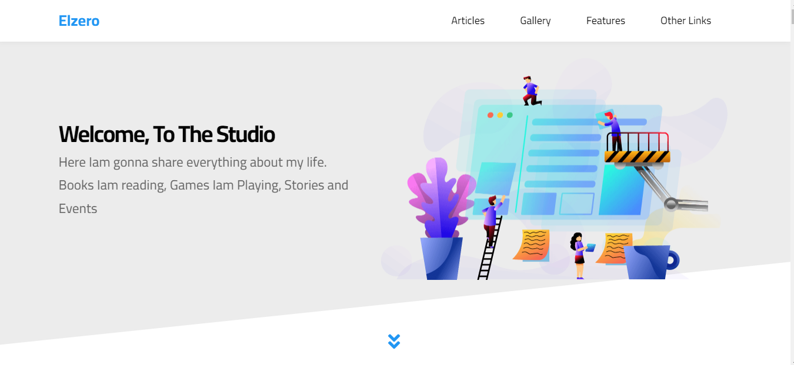
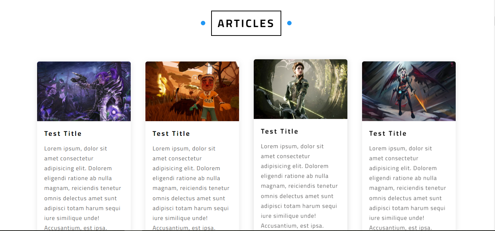
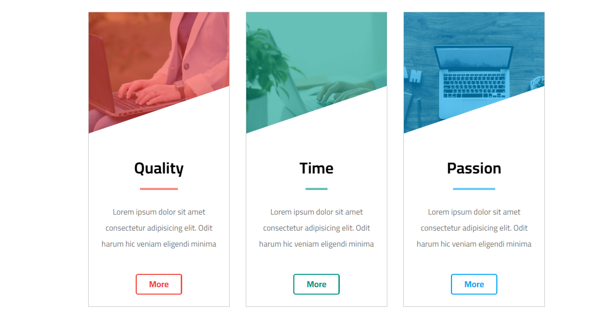
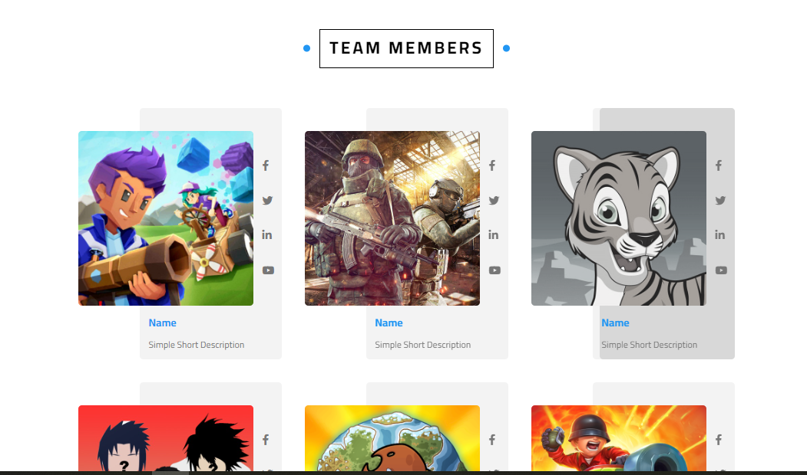
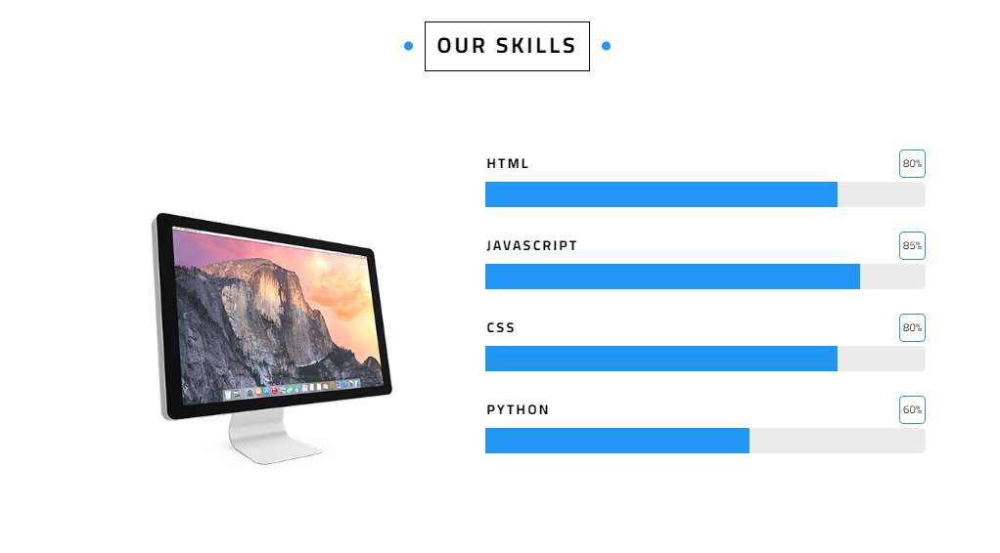
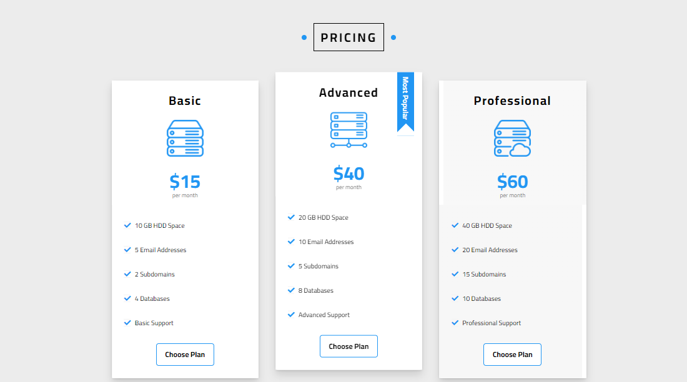
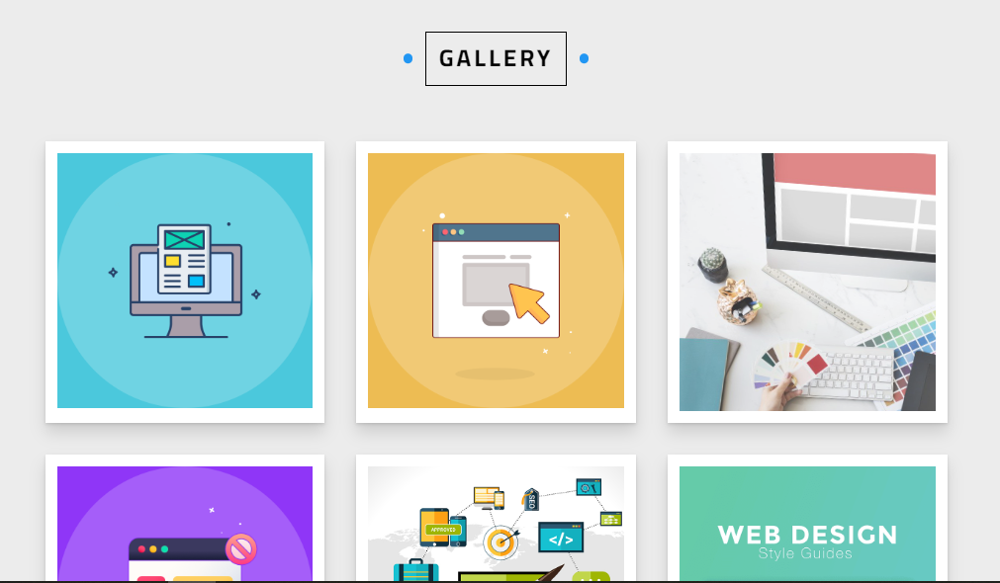
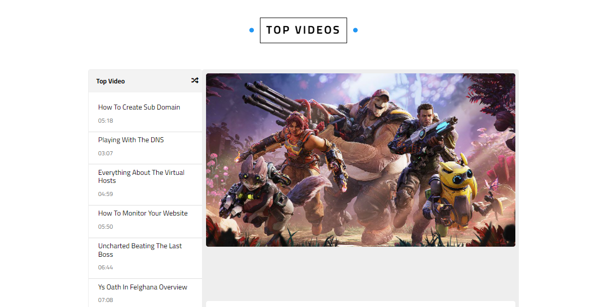
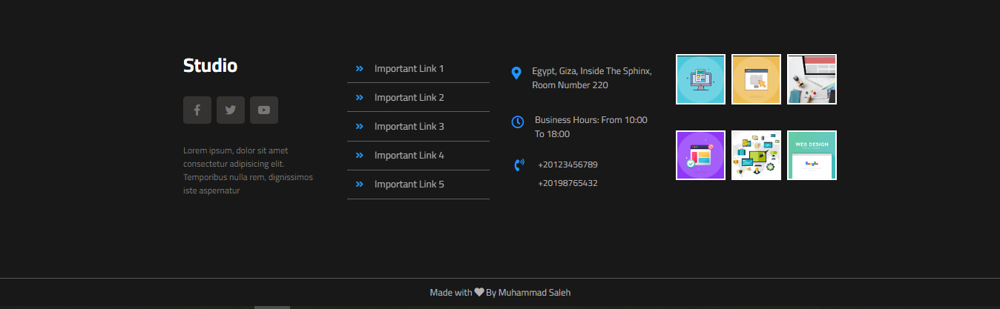

# Studio - UI Project - HTML/CSS Practice

- ## Live Demo 
    https://muhammadsaleh0.github.io/Studio-HTML-CSS  &nbsp;  

- ## Desktop  

 &nbsp;
 &nbsp;
 &nbsp;
 &nbsp;
 &nbsp;
 &nbsp;
 &nbsp;
 &nbsp;
 &nbsp;
 &nbsp;
 &nbsp;
 &nbsp;
